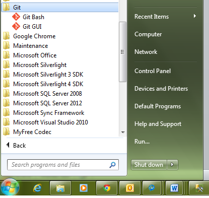
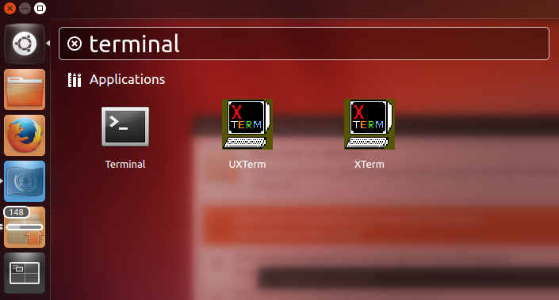
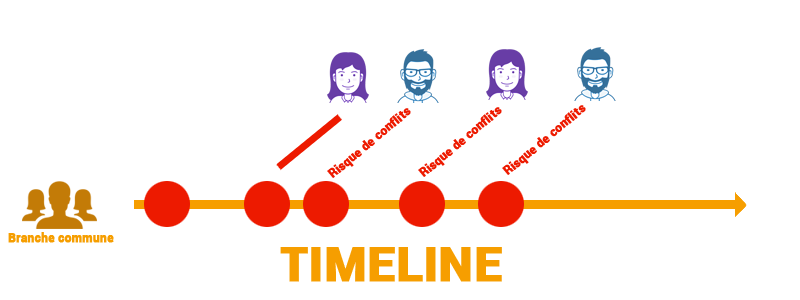
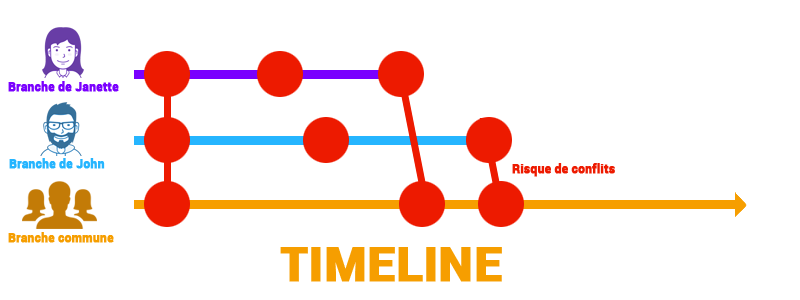
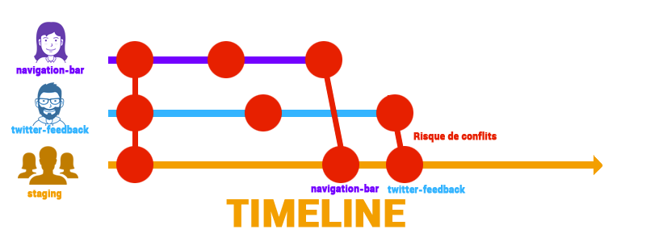
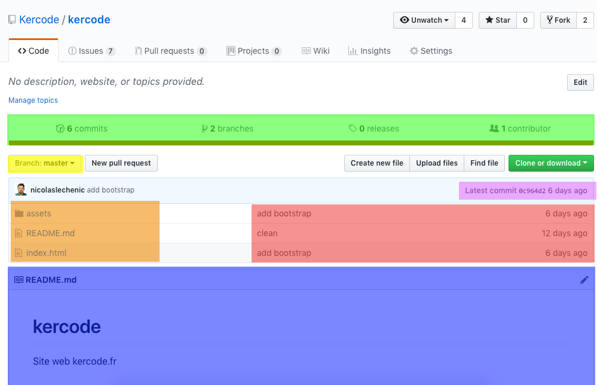

[:arrow_backward:](../README.md)

Fiche Bristol du cours sur Git et Github.

# Sommaire

- [Git](#git)
  - [Guide d'installation](INSTALL.md)
- [Ouvrir le terminal](#ouvrir-le-terminal)
  - [Windows](#windows)
  - [Mac](#mac)
  - [Linux](#linux)
- [Les branches](#les-branches)
- [Cheatsheet Git](CHEATSHEET.md)
- [Github](#github)
  - [Dépôt distant](#depot-distant)
  - [Issues](#issues)
  - [Pull request](#pull-request)
  - [Wiki](#wiki)

# Git

Git va vous permettre de "versionner" votre code càd conserver un historique des modifications dans le temps.

# Ouvrir le terminal

Afin de versionner votre projet vous aurez certainement besoin d'utiliser un invite de commande !

## Windows

:warning: Sous windows il faut lancer Git Bash afin de versionner son projet.

## Mac

Sous Mac, vous pouvez ouvrir le terminal avec Spotlight comme ci-dessous

## Linux

Sous Linux, le lancement dépend de votre distribution mais vous pouvez généralement en tapant la commande `Ctrl + Alt + T`

## Les branches

Git va aussi vous permettre de travailler sur des branches distinctes afin d'optimiser le travail en équipe et de réduire les conflits.

### Sans branches:

Ici, le fait d'avoir plusieurs personnes sur la même branche risque de créer des conflits pour chaques ajouts sur le code commun.

### Avec branches:

Dans la même configuration mais en ayant une branche par développeur, on réduit le nombre de conflits.

Ici, j'ai fais deux branches "janette" et "john" pour comprendre la notion de conflits.

Dans la réalité, ormis les branches communes, vos branches porteront les noms de fonctionnalités (feature en anglais) qu'elles implémentent (ex: `menu-navigation`).

Il y aura donc beaucoup plus de branches que de développeurs, et à chaque fois qu'une branche est fusionné (merge en anglais) avec la branche commune il sera plus facile de savoir ce qui vient d'être ajouté.

# Github

Github est la plateforme de dépôt distant. C'est grâce à cette plateforme qu'on pourra mettre en commun le travail des développeurs.

Github nous apporte aussi beaucoup de fonctionnalités qui permettent de mieux gérer notre projet (issues / review / wiki / gist)

## Dépôt distant

C'est la fonctionnalité principale de Github. On pourra y trouver plusieurs informations utiles sur le projet en cours.

### En vert

Ce sont des informations générales sur le projet, comme le nombre de commits (points de sauvegardes), le nombre de branches, les realeases (1.2.3 etc...) et le nombre de contributeurs.

Vous pouvez aussi cliquer sur la barre orange pour voir les différents langages utilisés pour ce projet.

### En jaune

Ici vous avez l'onglet qui vous permet de changer de branche, ici nous sommes sur la branche master qui est souvent utilisé pour la production, mais nous avons aussi une autre branche pour la pré-production (staging) qui est notre branche commune.

### En orange

L'arborescence du projet sur la branche en spécifié. Vous pouvez facilement naviguer dedans en cliquant sur les dossier et même éditer les fichiers directement depuis github. Cependant je vous le déconseille fortement car, comme tous bon développeurs, vous avez envie de tester vos modifications avant de les partager !

### En rouge

On retrouve des informations sur le dernier commit associé à chacun des fichier ou dossier.
D'abord le message de commit, vous savez quand vous faite `git commit -m 'mon message de commit'` puis la date de celui-ci.

### En bleu

Une partie très importante, le contenu du `README.md`. C'est ici qu'on met toutes les informations importantes pour quiconque souhaite contribuer au projet.

[Voici un template de README](https://gist.github.com/PurpleBooth/109311bb0361f32d87a2) que vous pourriez adapter au projet Kercode.

[En savoir plus sur la syntaxe markdown (`.md`)](https://github.com/adam-p/markdown-here/wiki/Markdown-Cheatsheet)

## Issues

TODO...

## Pull request

TODO...

## Wiki

TODO...

