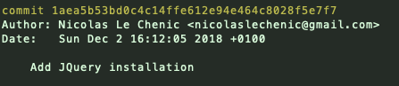

[:arrow_backward:](BRISTOL.md)

- [Les commandes](#les-commandes)
  - [Configuration de Git](#configuration-de-git)
  - [Création d'un projet](#creation-dun-projet)
  - [Projet existant](#projet-existant)

# Les commandes

## Configuration de Git

Si vous utilisez Git pour la première fois, vous aurez besoin de configurer vos informations utilisateur.

| Commandes                                | Description                          |
| ---------------------------------------- | ------------------------------------ |
| git config --global user.name "[nom]"    | Précise votre nom d'utilisateur      |
| git config --global user.email "[email]" | Précise votre email                  |

Ces informations seront ensuite disponible dans chaques commits.

## Création d'un projet

Si vous êtes à l'origine du projet vous devez initialiser Git comme ceci:

| Commandes                                | Description                                   |
| ---------------------------------------- | --------------------------------------------- |
| git init [nom]                           | Créer un dossier .git conservant l'historique |

## Projet existant