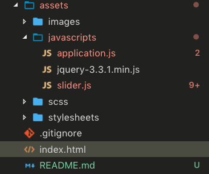

[:arrow_backward:](BRISTOL.md)

L'installation de JQuery est très simple, pour cela il suffit d'aller sur [la page de téléchargement du site](https://jquery.com/download/), de copier le script "compressed" dans votre projet et de le lier dans votre html:

```html
<!DOCTYPE html>
<html lang="fr">

<head>
  <meta charset="UTF-8">
  <script type="text/javascript" src="assets/javascripts/jquery-3.3.1.min.js"></script>
</head>

<body>
  <!--Some cool stuffs !-->
</body>
```

